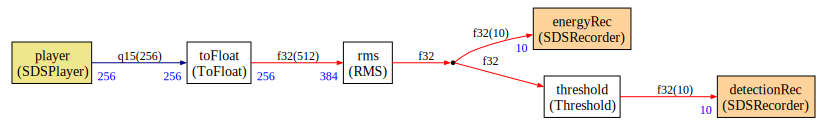

# CMSIS-Stream and Synchronous Data Streaming (SDS) Framework Example

This example demonstrates the usage of [Synchronous Data Streaming (SDS) Framework](https://github.com/ARM-software/SDS-Framework) nodes (player and recorder) in a [CMSIS-Stream](https://github.com/ARM-software/CMSIS-stream) graph.


The SDS player node plays a generated audio signal (a frequency sweep from `0 kHz` to `4 kHz` and with a sampling frequency of `8 kHz`).

The signal is filtered by an IIR filter to select a specific frequency range.

A moving windows filter (`rms`) is applied to the signal to compute the energy, which is then compared to a threshold.

Several SDS recorder nodes have been connected to the graph:

* `signalRec` to record the filtered signal
* `energyRec` to record the energy computation
* `detectionRec` to record the comparison to a threshold

Note that the outputs of `energyRec` and `detectionRec` have lower sampling frequencies compared to the output audio signal.

The `rms` node is using an entry buffer of `384` samples whereas other audio nodes are working with buffers of `256` samples. Recorder nodes for energy and detection are working with buffer of `10` samples. CMSIS-Stream can handle the connection of all those nodes even if they use quite different buffer sizes.

Recorder nodes can work with any datatype (here `f32` and `q15`).

## Recorded signals

This chapter contains the plots of the signals that were recorded with the `SDSRecorder` nodes running on [Arm Virtual Hardware](https://arm-software.github.io/AVH/main/overview/html/index.html).

### Filtered signal

Node `signalRec`


### Energy computation

Node `energyRec`


### Detection

Node `detectionRec`


## Building the demo

The first time:

```shell
cbuild --toolchain AC6 -p -r --update-rte -c Demo.Release+AVH_MPS3_Corstone-300 Demo.csolution.yml 
```

Other times:

```shell
cbuild --toolchain AC6 -c Demo.Release+AVH_MPS3_Corstone-300 Demo.csolution.yml
```

## Running the demo

On Windows:

```shell
FVP_Corstone_SSE-300_Ethos-U55.exe -f framework\layer\Board\AVH_MPS3_Corstone-300\fvp_config.txt -a out\Demo\AVH_MPS3_Corstone-300\Release\Demo.axf
```

On Linux, the line would be similar:

## Python commands

Before using the Python scripts listed in this section, you'll need to install the required python modules:

```shell
pip install -r requirements.txt
```

### Displaying the results

Execute the following commands to generate a plot of the recorded signals.

#### The filtered audio

```shell
python sds-view.py -y Audio.sds.yml -s AudioRec.0.sds
```

#### The energy and detection signals

```shell
python sds-view.py -y Energy.sds.yml -s EnergyRec.0.sds
python sds-view.py -y Detection.sds.yml -s DetectionRec.0.sds
```

### Regenerating signal and filters

#### Regenerating the input audio file

To regenerate the dummy input audio signal, run:

```shell
python gen_samples.py
```

With option `-d`, a debug signal is generated: a ramp from -32768 to 32767.

With option `-s`, an heaviside signal is generated.

#### Regenerating the IIR filter

To regenerate the IIR filter, enter this command:

```shell
python iir_filter_design.py
```

If you need to display the transfer function you can do:

```shell
python iir_filter_design.py -p
```

If you need to see the filtered signal (to compare with the result of the simulation), run:

```shell
python iir_filter_design.py -t
```

### Compute graph

You can regenerate the compute graph with:

```shell
python ComputeGraph/graph.py 
```

Then you can update the `png` representing the graph with ([graphviz](https://graphviz.org/) must be installed):

```shell
dot -Tpng -o ComputeGraph\Pictures\graph.png ComputeGraph\Pictures\graph.dot     
```

You can change the graph by modifying the content of `graph.py`. When you modify the graph, rebuild it with:

```shell
python ComputeGraph/graph.py 
cbuild --toolchain AC6 -c Demo.Release+AVH_MPS3_Corstone-300 Demo.csolution.yml
```

These commands will only rebuild one file.

## Limitations of the demo

This demo only supports one player. The `SDSPlayer` node implementation in this demo waits on a timestamp with [`osDelayUntil`](https://arm-software.github.io/CMSIS_6/latest/RTOS2/group__CMSIS__RTOS__Wait.html#ga3c807924c2d6d43bc2ffb49da3f7f3a1).

If several players were used, those waits may create problems (and buffer overflows). It may be better in this case to have a global wait consistent with all players in each iteration of the scheduling loop.

## Replay

You can replay the previously recorded signal easily. In the beignning, the `player` node was playing an SDS audio file (`Audio.0.sds`) that was filtered by an IIR filter. The filtered signal was recorded to the `signalRec` node (in the file `AudioRec.0.sds`). Now, we're replaying the `signalRec` signal, thus eliminating the first couple of blocks from the initial graph. As the `signalRec` was converted to fixed point before stores, we need to apply a `toFloat` conversion to be compatible with the initial run. Here's what we do:


If you run the `graph.py` script with option `-r` it will generate a replay mode graph:

```shell
python ComputeGraph/graph.py -r
```



The new `player` node is now playing the SDS file `AudioRec.0.sds`.

In the replay graph, there is no more any filter. The energy and detection are done on the recorded filtered signal.

Energy and detection nodes will give nearly the same result on the new recorded signal. The differences are due to the fixed point conversion. In the original graph, the `rms` node is working directly from the `float` output of the `iir`. But, in this demo we have decided to convert the output of the `iir` to fixed point before recording the filtered audio.

With SDS and CMSIS-Stream it is easy to record and replay from any point in the graph!
